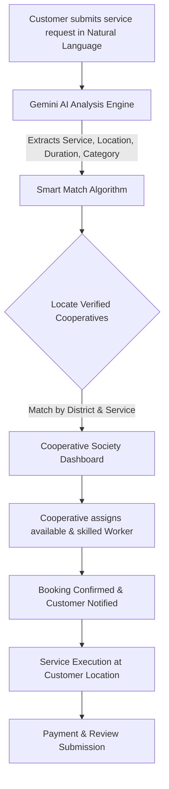

# 🪺 SkilldNest (Skill D Nest)

> **"Local Skills. Trusted Services."**  
> A Next-Generation, Cooperative-First Digital Gig Platform powered by AI.  
> *Developed as an innovation for Smart India Hackathon (SIH).*

---

[](https://www.sih.gov.in/)
[](https://react.dev/)
[](https://nodejs.org/)
[](https://www.mongodb.com/)
[](https://ai.google.dev/)
[](LICENSE)

---

## 📌 Table of Contents

- [Problem Statement \& Vision](#-problem-statement--vision)
- [Key Features](#-key-features)
- [How It Works (System Flow)](#-how-it-works-system-flow)
- [AI Smart Matching Engine (Gemini)](#-ai-smart-matching-engine-gemini)
- [Service Categories](#-service-categories)
- [Tech Stack](#-tech-stack)
- [Architecture \& Data Models](#-architecture--data-models)
- [API Endpoints Overview](#-api-endpoints-overview)
- [Project Directory Structure](#-project-directory-structure)
- [Installation \& Getting Started](#-installation--getting-started)
- [Environment Variables](#-environment-variables)
- [Future Roadmap](#-future-roadmap)
- [Contributing \& Acknowledgements](#-contributing--acknowledgements)

---

## 🎯 Problem Statement & Vision

In India's rapidly growing gig economy, informal sector workers (farm laborers, electricians, carpenters, daily wagers) frequently suffer from:
1. **Predatory Middlemen**: High commission cuts (20-35%) charged by commercial aggregators.
2. **Lack of Identity & Trust Verification**: Customers hesitate to hire unverified workers; workers lack recognized credentials.
3. **Underutilized Cooperative Societies**: Rural and semi-urban cooperative bodies already have ground-level trust and worker bases, but lack modern digital platforms.
4. **Language & Interface Barriers**: Most workers and rural clients struggle with rigid, complex booking forms.

### 💡 The SkilldNest Solution
**SkilldNest** leverages existing **Cooperative Societies** as trust anchors to organize local labor sustainably. Instead of exploiting workers, the cooperative model returns platform value to worker welfare. Powered by **Google Gemini AI**, customers can describe needs in everyday natural language (including Hinglish), and the platform intelligently dispatches vetted workers through their affiliated local cooperative society.

---

## ✨ Key Features

- 🤝 **Cooperative-First Business Model**: Decentralized operations managed by verified local cooperative societies, ensuring fair wages and community profit-sharing.
- 🧠 **AI Smart Match (Google Gemini)**: Natural language requirement analysis. Users can type queries like:
  > *"Mujhe Satna mein 2 din ke liye wheat harvesting worker chahiye"*  
  The engine parses service type, target location, duration, and urgency to recommend matching cooperatives and workers.
- 👥 **Role-Based Access Control (RBAC)**: Dedicated portals for **Customers**, **Cooperatives**, **Workers**, and **Admins**.
- 🛡️ **Two-Tier Verification**:
  - Cooperatives are audited and verified by platform Administrators.
  - Workers are vetted, registered, and managed by their local cooperative.
- 📊 **Real-Time Dashboards**:
  - **Customer Portal**: Post requests, view matching providers, book services, track progress, make payments, and write reviews.
  - **Cooperative Portal**: Add/manage worker rosters, assign jobs, track society revenue, and monitor service completion.
- 🔔 **In-App Notification Engine**: Real-time status updates on booking approvals, worker assignments, and payment statuses.
- 💳 **Transparent Billing & Payments**: Transparent breakdown of worker wages, minor cooperative administrative fees, and digital transaction receipts.

---

## 🔄 How It Works (System Flow)



---

## 🤖 AI Smart Matching Engine (Gemini)

SkilldNest integrates **Google Gemini API** (`gemini-2.5-flash-lite` / `@google/genai`) to eliminate cumbersome forms:

### Example Input:
```text
"Mere ghar mein AC ka switchboard spark kar raha hai, jald se jald electrician bhejo Rewa mein"
```

### AI Extracted JSON:
```json
{
  "service": "Electrician",
  "location": "Rewa",
  "category": "Household",
  "duration": "Immediate",
  "priority": "urgent"
}
```

The extracted metadata queries the MongoDB database to retrieve cooperatives offering electrical services in Rewa with active, top-rated workers.

---

## 🛠️ Service Categories

| Category | Typical Services | Target Users |
| :--- | :--- | :--- |
| 🌾 **Agriculture** | Harvesting, Sowing, Crop Spraying, Tractor Operation, Irrigation setup | Farmers, Agribusinesses, Orchards |
| ⚡ **Household** | Electrical wiring, Plumbing, Appliance Repair, Carpentry, Painting | Urban & Semi-Urban Households |
| 🏘️ **Community & Civic** | Event Logistics, Sanitation drives, Local transport, Infrastructure maintenance | Panchayats, Societies, Local Institutions |

---

## 💻 Tech Stack

### Frontend
- **Framework**: [React 19](https://react.dev/) with [Vite](https://vitejs.dev/)
- **Routing**: [React Router v7](https://reactrouter.com/)
- **Styling**: Pure CSS3 with Glassmorphism, animations, and responsive layout
- **Icons**: [Lucide React](https://lucide.dev/)
- **HTTP Client**: [Axios](https://axios-http.com/)

### Backend
- **Runtime**: [Node.js](https://nodejs.org/) (ES6+ CommonJS)
- **Framework**: [Express.js v5](https://expressjs.com/)
- **Database**: [MongoDB](https://www.mongodb.com/) with [Mongoose ODM](https://mongoosejs.com/)
- **AI/LLM**: [Google Generative AI](https://ai.google.dev/) (`@google/genai`, `@google/generative-ai`)
- **Authentication**: JSON Web Tokens (JWT) & `bcryptjs`
- **Environment Management**: `dotenv` & `cors`

---

## 📐 Architecture & Data Models

- **`User`**: Base identity storing auth credentials, phone, and role (`Admin`, `Customer`, `Cooperative`, `Worker`).
- **`Customer`**: Customer profile containing addresses, preferences, and booking history.
- **`Cooperative`**: Society records, government registration number, contact person, verified district/state, service catalog, and rating.
- **`Worker`**: Member profiles linked to a cooperative, specialized skills, hourly/daily wage rates, experience, and verification badge.
- **`Booking`**: Service contract linking Customer, Worker, and Cooperative with statuses (`Pending`, `Confirmed`, `Completed`, `Cancelled`).
- **`Payment`**: Transaction logs, cooperative commission calculation, and disbursement tracking.
- **`Review`**: Dual feedback mechanism for both worker quality and customer reliability.
- **`Notification`**: System alerts for state changes and booking requests.

---

## 📡 API Endpoints Overview

| Method | Endpoint | Description | Protected | Roles |
| :--- | :--- | :--- | :---: | :--- |
| `POST` | `/api/auth/register` | Register new user account | No | All |
| `POST` | `/api/auth/login` | Login and obtain JWT token | No | All |
| `POST` | `/api/smart-match` | AI parse request + recommend cooperatives/workers | Yes | Customer |
| `POST` | `/api/ai/analyze` | Raw AI extraction of service request string | Yes | Customer |
| `GET` | `/api/services` | List all available service categories | No | Public |
| `GET` | `/api/cooperatives` | Query verified cooperative societies | Yes | All |
| `POST` | `/api/cooperatives/register`| Register a cooperative society with verification docs | Yes | Cooperative |
| `POST` | `/api/workers` | Enroll a new worker under a cooperative | Yes | Cooperative |
| `GET` | `/api/workers` | Fetch available workers filtered by skills & district | Yes | All |
| `POST` | `/api/bookings` | Create new service booking | Yes | Customer |
| `PUT` | `/api/bookings/:id/status`| Update booking status (Accept/Assign/Complete) | Yes | Cooperative, Customer |
| `POST` | `/api/reviews` | Post ratings & review after completion | Yes | Customer |
| `GET` | `/api/notifications` | Retrieve unread user notifications | Yes | All |
| `GET` | `/api/admin/cooperatives` | Verify or reject pending cooperative registrations | Yes | Admin |

---

## 📂 Project Directory Structure

```plaintext
SkilldNest-SIH/
├── backend/
│   ├── config/
│   │   └── db.js                 # MongoDB connection logic
│   ├── middleware/
│   │   ├── authMiddleware.js     # JWT token verification
│   │   └── roleMiddleware.js     # RBAC role guards
│   ├── models/                   # Mongoose data schemas
│   │   ├── Booking.js
│   │   ├── Cooperative.js
│   │   ├── Customer.js
│   │   ├── Notification.js
│   │   ├── Payment.js
│   │   ├── Review.js
│   │   ├── Service.js
│   │   ├── User.js
│   │   └── Worker.js
│   ├── routes/                   # Express route controllers
│   │   ├── adminRoutes.js
│   │   ├── aiRoutes.js
│   │   ├── authRoutes.js
│   │   ├── bookingRoutes.js
│   │   ├── cooperativeRoutes.js
│   │   ├── customerRoutes.js
│   │   ├── notificationRoutes.js
│   │   ├── paymentRoutes.js
│   │   ├── reviewRoutes.js
│   │   ├── serviceRoutes.js
│   │   ├── smartMatchRoutes.js
│   │   └── workerRoutes.js
│   ├── utils/
│   │   └── aiService.js          # Google Gemini AI client integration
│   ├── .env.example              # Sample environment template
│   └── server.js                 # Express application entrypoint
├── frontend/
│   ├── public/
│   ├── src/
│   │   ├── assets/               # Logos and branding assets
│   │   ├── pages/                # React views & dashboards
│   │   │   ├── Welcome.jsx
│   │   │   ├── Login.jsx
│   │   │   ├── CustomerDashboard.jsx
│   │   │   ├── CustomerLogin.jsx
│   │   │   ├── CustomerRegister.jsx
│   │   │   ├── CooperativeDashboard.jsx
│   │   │   ├── CooperativeLogin.jsx
│   │   │   ├── CooperativeRegister.jsx
│   │   │   ├── AddWorker.jsx
│   │   │   └── WorkerManagement.jsx
│   │   ├── App.jsx               # Router configuration
│   │   ├── main.jsx              # Vite React root
│   │   └── index.css
│   ├── package.json
│   └── vite.config.js
├── package.json                  # Root backend scripts & dependencies
└── README.md                     # Comprehensive project documentation
```

---

## 🚀 Installation & Getting Started

### Prerequisites
- [Node.js](https://nodejs.org/) (v18.x or later recommended)
- [MongoDB](https://www.mongodb.com/) (Local instance or MongoDB Atlas URI)
- [Google Gemini API Key](https://aistudio.google.com/app/apikey)

### 1. Clone the Repository
```bash
git clone https://github.com/Saurabh2807/SkillDnest.git
cd SkillDnest
```

### 2. Backend Setup
```bash
# Install root/backend dependencies
npm install

# Create environment configuration
cp backend/.env.example backend/.env
```

Edit `backend/.env` with your credentials:
```env
PORT=5000
MONGO_URI=mongodb://localhost:27017/skilldnest
JWT_SECRET=your_super_secret_jwt_key
GEMINI_API_KEY=your_gemini_api_key_here
```

Start the backend server:
```bash
npm run dev
# Server will start on http://localhost:5000
```

### 3. Frontend Setup
In a new terminal window:
```bash
cd frontend

# Install frontend dependencies
npm install

# Start Vite development server
npm run dev
# Frontend will be live at http://localhost:5173
```

---

## ⚙️ Environment Variables

| Variable | Description | Example / Default |
| :--- | :--- | :--- |
| `PORT` | Port for Express backend server | `5000` |
| `MONGO_URI` | MongoDB connection string (Local or Atlas) | `mongodb://localhost:27017/skilldnest` |
| `JWT_SECRET` | Secret key used for signing authentication tokens | `custom_secure_secret_token` |
| `GEMINI_API_KEY` | Google Gemini AI Studio API key for prompt parsing | `AIzaSy...` |

---

## 🗺️ Future Roadmap

- [ ] **Multilingual Voice Support**: Integration with Bhashini API for hands-free local voice dialect booking.
- [ ] **Offline USSD / IVR Flow**: Enable basic feature-phone users to request workers without internet access.
- [ ] **Micro-Insurance & Pension Schemes**: Seamless micro-deductions into government welfare schemes (PMSBY / PM-SYM) for cooperative members.
- [ ] **Geo-Fencing & Live Map Tracking**: Accurate tracking of worker arrival for urban household emergency services.
- [ ] **Escrow Smart Contracts**: Automated dispute settlement and instant payout distribution upon OTP confirmation.

---

## 👥 Smart India Hackathon (SIH) Showcase

- **Repository**: [https://github.com/Saurabh2807/SkillDnest](https://github.com/Saurabh2807/SkillDnest)
- **Problem Statement Focus**: Empowering Cooperative Societies & Informal Sector Gig Workers through Ethical AI and Digital Access.

---

<div align="center">
  <sub>Built with ❤️ for <b>Smart India Hackathon</b> by the SkilldNest Team.</sub>
</div>
